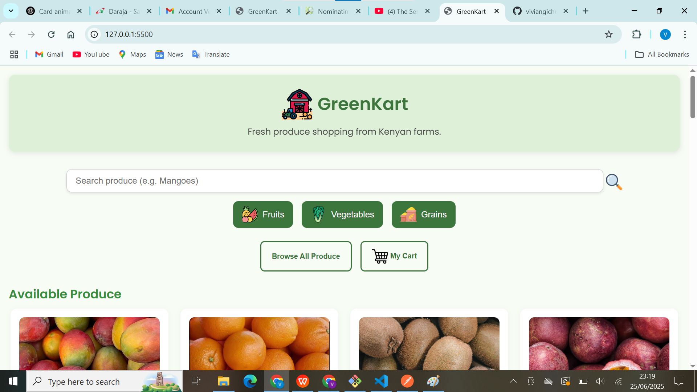

# GreenKart - Fresh Produce Shopping from Kenyan Farms

GreenKart is a responsive and user-friendly web application designed to help users discover, filter, and shop for fresh produce (fruits, vegetables, grains) sourced directly from Kenyan farms. Built with simplicity and accessibility in mind, it allows customers to browse produce, add items to a cart, and calculate delivery based on location.

## Screenshots

>   

## Features

- Search for produce by name
- Filter by category: Fruits, Vegetables, Grains
- Add items to cart with quantity support
- Calculate delivery charges based on user location
- Fully responsive and mobile-friendly
- 🇰🇪 Localized for the Kenyan market

## Technologies Used

- **HTML**
- **CSS**
- **JavaScript**
- **Google Fonts - Poppins**
- **Icons:** PNG format icons for UI elements

## How to Use
- Search produce by typing in the input box.
- Filter by category using the filter buttons.
- Browse All to view all produce.
- Add to Cart and adjust quantities as needed.
- Go to My Cart, input your delivery location (e.g., Nairobi).
- Click Calculate Total to view delivery costs.
- Pay via Pochi La Biashara: 0742179262.

## To-Do (Future Enhancements)
- Add quantity selector and total price
- Integrate with M-Pesa API for real payments
- User login and order history
- Admin dashboard for produce management

## Author
**Vivian Gichure**
**Frontend Web Developer Frontend Developer | Backend Developer| Kenya**
**GitHub:** https://github.com/viviangichuregithub/Phase-1-Main-Project
**Email:** viviangichure@gmail.com
